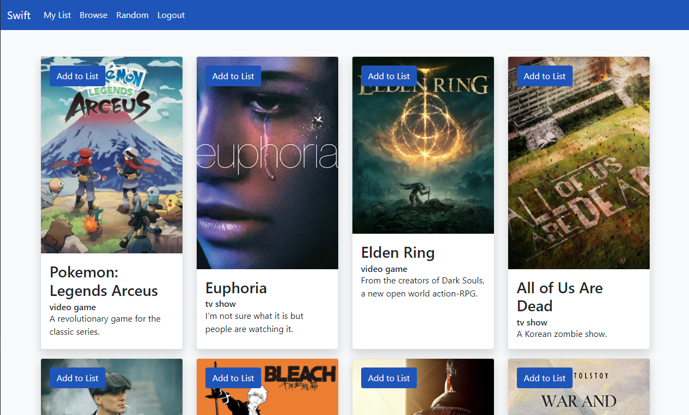

# catch-up

An application where users can login, and store a list of any media (tv shows, movies, books, etc.) that they need to catch up on. It is built on node JS with express and handlebars, MySQL with the Sequelize ORM, multer for handling image uploads, and Bootstrap for style.

## Contributors
- [Chris Cavazos](https://github.com/cavazosdotcom)
- [Malcolm Hendrix](https://github.com/Malcolm0729)
- [Cameron Seibel](https://github.com/CameronMSeibel)

## Links

[](https://catch-up-inator.herokuapp.com/)

[Github Repo](https://github.com/cavazosdotcom/catch-up)

## User Story

```
AS A USER

I WANT to create a list of show/books/movies/etc...

SO THAT I CAN catch up on all of my backlogs

```

